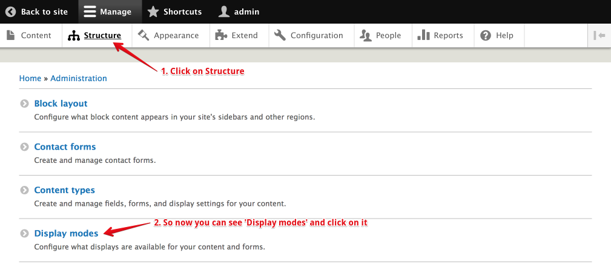
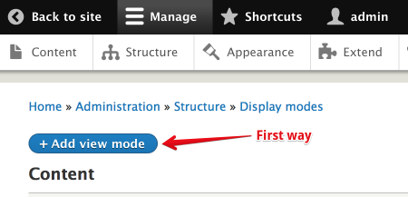
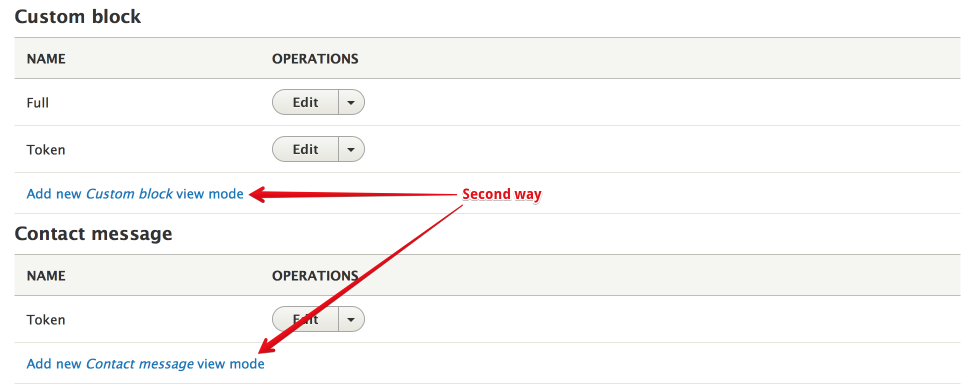
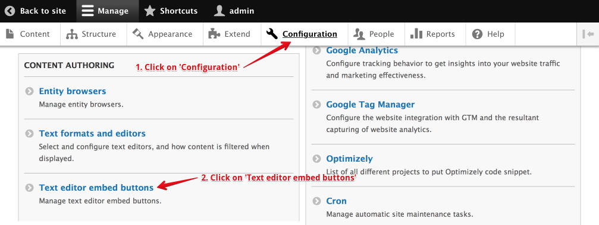
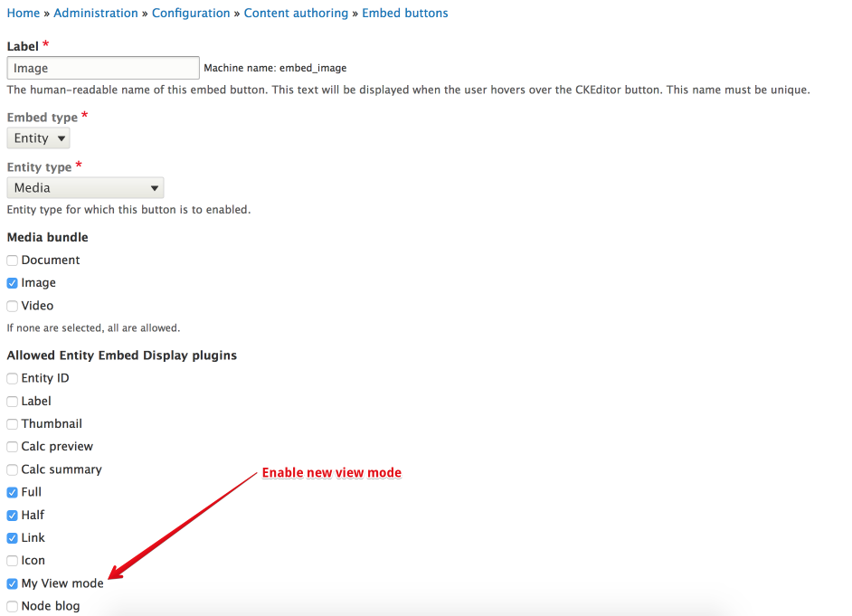

As with any other entity in Drupal, when it comes to render the rendering it in different contexts, you might want to have specific view modes.

Here you can find instructions how you can add new view modes into embedded entity form on YMCA Website Services distribution.

### Create a new View Mode

1. Go to 'View modes' page: Structure -> Display modes -> View modes (or visit the URL: `/admin/structure/display-modes/view`

2. Create new view mode: click 'Add view mode' button and select entity type (or visit the URL: `/admin/structure/display-modes/view/add`

or after each entity type you can see 'Add new {Name} view mode' and click on it

3. Select "Media" and then give a name to your new view mode (or visit the URL: /`admin/structure/display-modes/view/add/media`

### Use the View Mode

1. Go to Configuration -> Text editor embed buttons (or visit the URL: `/admin/config/content/embed`

2. Then make sure you enable the new view mode in "Allowed Entity Embed Display plugins", and at the bottom of the page click "Save".

