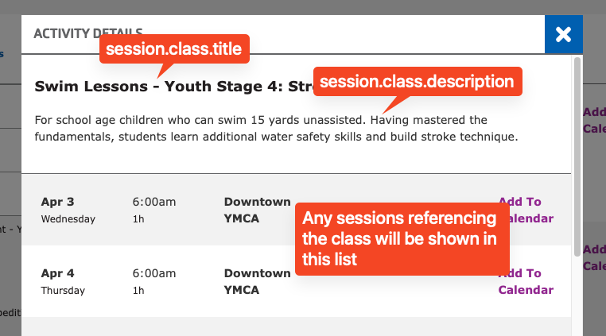

Sometimes called "Group Exercise" or "Group Schedules", the **Repeat Schedules** block provides a similar view to Activity Finder, but focuses on recurring, often drop-in classes. You can see [an example of this on our sandbox site](https://sandbox-carnation-cus.y.org/schedules-0).

Developers can find more information in [`ynorth-project/openy_repeat`](https://github.com/ynorth-projects/openy_repeat) and [Program Event Framework](../../../development/program-event-framework).

As of August 2024, the Schedules have [an updated design](https://www.figma.com/design/wVbmVOI5zwOMDYRjI3GLEI/YUSA-Design-System?node-id=4980%3A17269&t=GBUj9iIBpCBJw6yW-1) with improved functionality and user experience. The improved design will also respond to the selected [colorway and page styles](../../layout-builder/advanced-options/#page-styles).

## Using Group Schedules

- [Repeat Schedules Paragraph](../../paragraphs/repeat-schedules)
- [Repeat Schedules Layout Builder](../../layout-builder/repeat-schedules)
  - Available with `openy_repeat` [2.2.0 and above](https://github.com/ynorth-projects/openy_repeat/releases) via the **Repeat (Group) Schedules** (`lb_repeat_schedules`) module.

## Block configuration

After you add the Paragraph or Block to a page, configure the options:

- **PDF Schedule link** - a link to a manually generated PDF as an alternative to the automatically generated one.
- **Clear All link** - where the user is directed when they use the "Clear all" link.
- **Limit by category** - choose categories with autocomplete to only show certain categories.
- **Filters** - choose the filters that show up in the sidebar.
- **Limit by Location** - choose a location to only show events from that location.
- **Display instructor**
- **Display end time**
- **Categories Exclude** - exclude any programs that are tagged with specific categories.
- **PDF only view** - only show the PDF link and not the schedule.

## Front-end

Data from Sessions, Classes, and Activities are all used to form the Repeat Schedules. Here's what shows up where. Fields are noted with their relationships, so `session.class.activity.title` means "the title of the Activity referenced by the Class referenced by the Session".

Fields used in the table view:

Fields used in the popup view:

