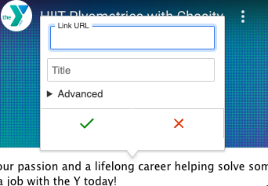
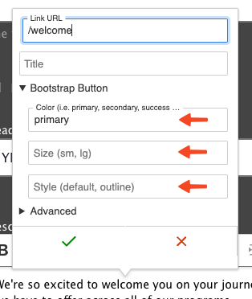
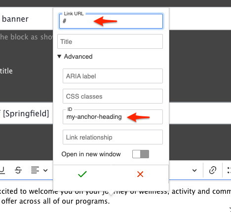



-----

Links are simple in YMCA Website Services - just highlight your text and click the link icon (`🔗`) or type <kbd>Ctrl</kbd> / <kbd>Cmd</kbd> + <kbd>K</kbd>. Once the pop-up appears, type your URL into the field and click **Save**.

*[Read more and demo this on CKEditor Site.](https://ckeditor.com/docs/ckeditor5/latest/features/link.html)*


{}

{}
{}

{}


## Advanced options

In the Advanced options of the link dialog, you can add attributes to links, including a label, HTML ID, and CSS classes. You can also opt to have your link open in a new window/tab.


{}

{}
{}

{}


### Using button classes

The [Button editor](../building-buttons) that existed in the prior version of the text editor (CKEditor 4) has [changed with CKEditor 5 and Drupal 10](https://www.drupal.org/project/editor_advanced_link/issues/3423208). Content editors can now add button classes alongside the Advanced Link Options.

Create a button by adding [Bootstrap classes](https://getbootstrap.com/docs/4.6/components/buttons/) to a link:

- Create a regular link in a Layout Builder block.
  - We recommend only using custom buttons in large text blocks, like the [Table](../../layout-builder/table) or [Code](../../layout-builder/code) blocks.
- Open the Bootstrap Button Options.
- Add the button classes for Color, Size, and Style (see [Button Classes](#button-classes)). Do not use the `btn` prefix when entering options in the Bootstrap Button fields, those will be added for you. 
  - Button styles in the editor may not match the displayed styles.
- Save the block.

#### Button classes

The distribution combines the default [Boostrap button component](https://getbootstrap.com/docs/4.6/components/buttons/) with some custom styles as demonstrated at [YMCA Lincoln, NE](https://www.ymcalincoln.org/buttons).

- Any time you are making a button, your **CSS classes** should begin with `btn `. That sets up the default button styles.
- Then, choose a button style, like `btn-primary` or `btn-light`.
  - Button styles should generally not be combined.
  - Some Bootstrap styles may be overridden by our theme.
  - The `btn-primary` style will use the selected colorway for its color, but all other options may use other colors that are not brand compliant.
- The **CSS classes** field should have at least two space-separated items when you're finished, like `btn btn-primary`.

It's best to experiment with styles and make sure to check that your button displays as expected before saving the page.

## Anchor links

If you're building a long landing page, you may want to be able to link users directly to a specific section of the page. We do this using an "anchor" link or "in-page" [URI fragment](https://en.wikipedia.org/wiki/URI_fragment).

The process involves two steps:

1. Adding the in-page anchor.
2. Creating a link to the anchor.

### Adding an anchor

An anchor is any piece of content—anything from a heading to a tiny space—that has an `id` in its code. The easiest way to add this is by creating a small hidden link at the beginning of the section in which you'd like to link to.

- Edit the section where you want to add the anchor
- Add an empty space at the end of the first line of the section
- Select just the space, then click the <kbd>🔗</kbd> button in the editor toolbar.
- In the Link popup, set the **URL** to `#`
- Expand the Advanced options and set the **ID** field to your anchor. It should be short and contain only lowercase letters and dashes, like `thank-you` or `adding-an-anchor`.
- Click Save in the Link popup, then save the page.

Once you've saved the page, you can test the anchor out by appending a `#` then the `id` to your page URL. For instance, this section's URL with anchor is:

`https://ds-docs.y.org/docs/user-documentation/text-editor/adding-links#adding-an-anchor`

If you enter that URL in your browser, it should take you directly to the anchor in the page.

### Linking to the anchor

To link to the anchor, we create a regular link and then add the anchor:

- Create an in-page link as you usually would, either with a Link field or the Text Editor.
- Instead of referencing the page with autocomplete (if it's available), use the "relative path" of the page—that is, everything _after_ the domain. For instance, when linking to this page in a site, you could use `/docs/user-documentation/text-editor/adding-links`.
- Add the anchor ID after the path, so that your complete link looks like `/docs/user-documentation/text-editor/adding-links#adding-an-anchor`.
- Save the page.

Now, your internal link should take users to the exact location in the page that you've specified.

> **TIP:** If your anchor doesn't quite go where you expect, or the section is hidden by your navigation when you use the link, try moving the anchor to the end of the previous section instead of the start of the section you're trying to anchor to, that way users will end up with the right section of the page in view.

## Linking tips

* For links on your website, don’t use the full URL. Delete everything beginning with the `/` after your `.com`, `.org`, etc.
  * For example, for ymca.org/about, you would choose /about. This is called the relative path, and it will help your analytics tracking.
* For links on other websites, grab the full URL, including the `https://`.
  * For example, for example.org/about, you would choose `https://example.org/about`.
* For email links, add `"mailto:example@example.org."`

To update/change a link, click on the link text then click the link icon or use the popup options (in CKEditor 5).

To remove a link, highlight the link text and click the unlink icon.

## Improving internal linking with Linkit

A community-contributed module, [Linkit](https://www.drupal.org/project/linkit)

> provides an autocomplete interface for internal and external linking in rich-text editors. Linkit supports nodes, users, taxonomy terms, files, comments and basic support for all types of entities that define a canonical link template.

Drupal core will [soon provide link autocomplete suggestions](https://www.drupal.org/project/drupal/issues/3317769) in CKEditor similar to what this module does. Until that issue is complete, developers may want to [install and configure Linkit](https://www.drupal.org/project/linkit) to improve the linking experience in the WYSIWYG editor.
